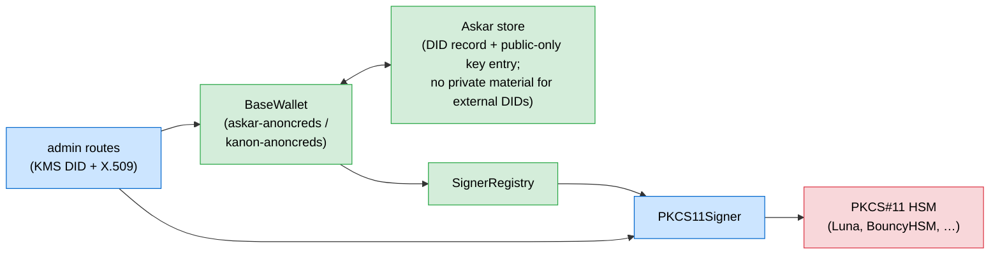
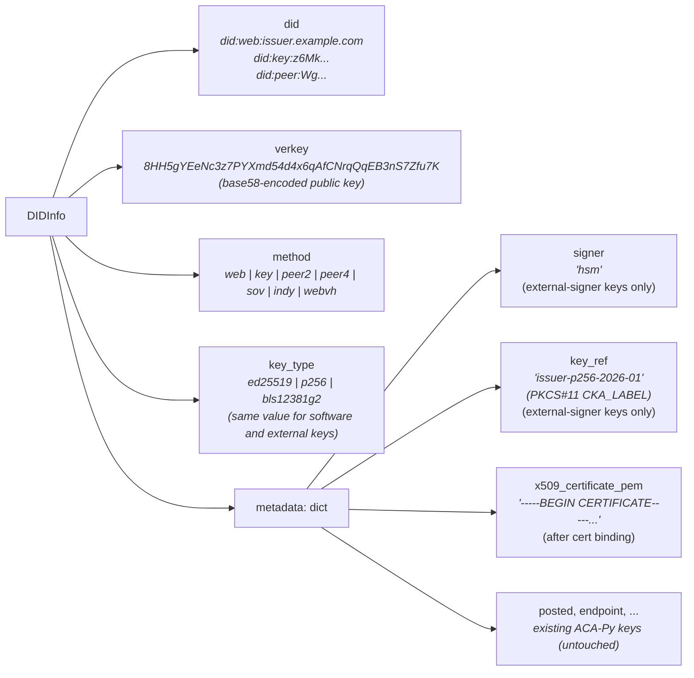
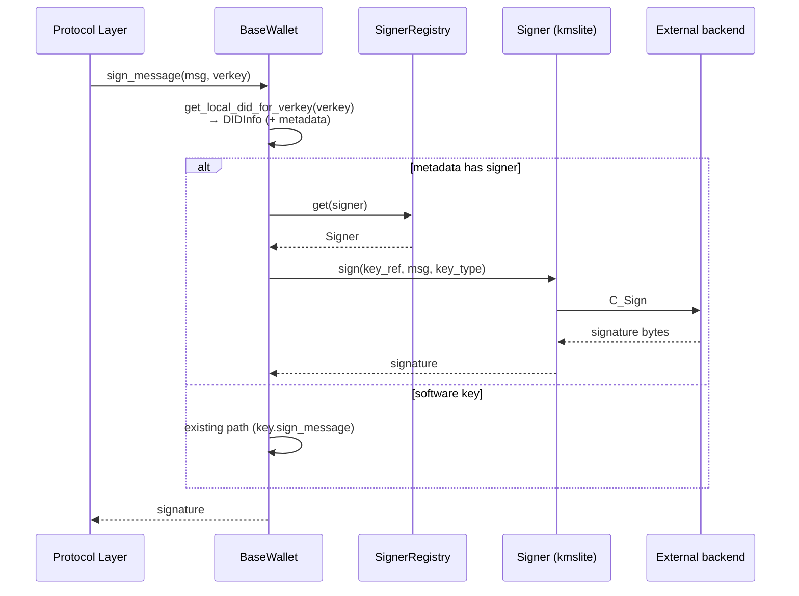
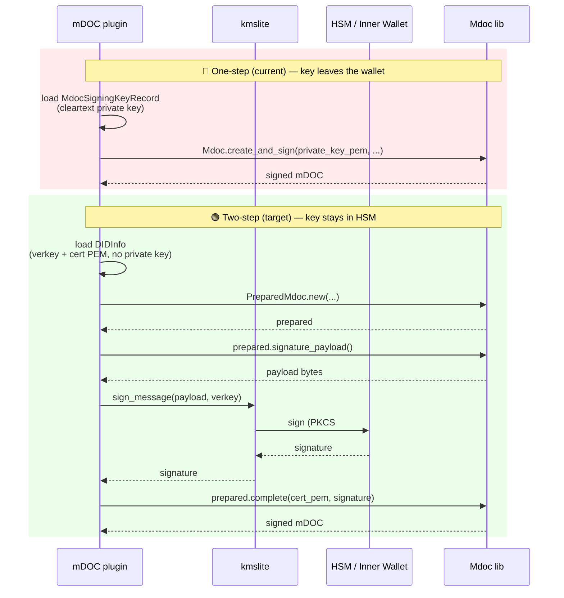
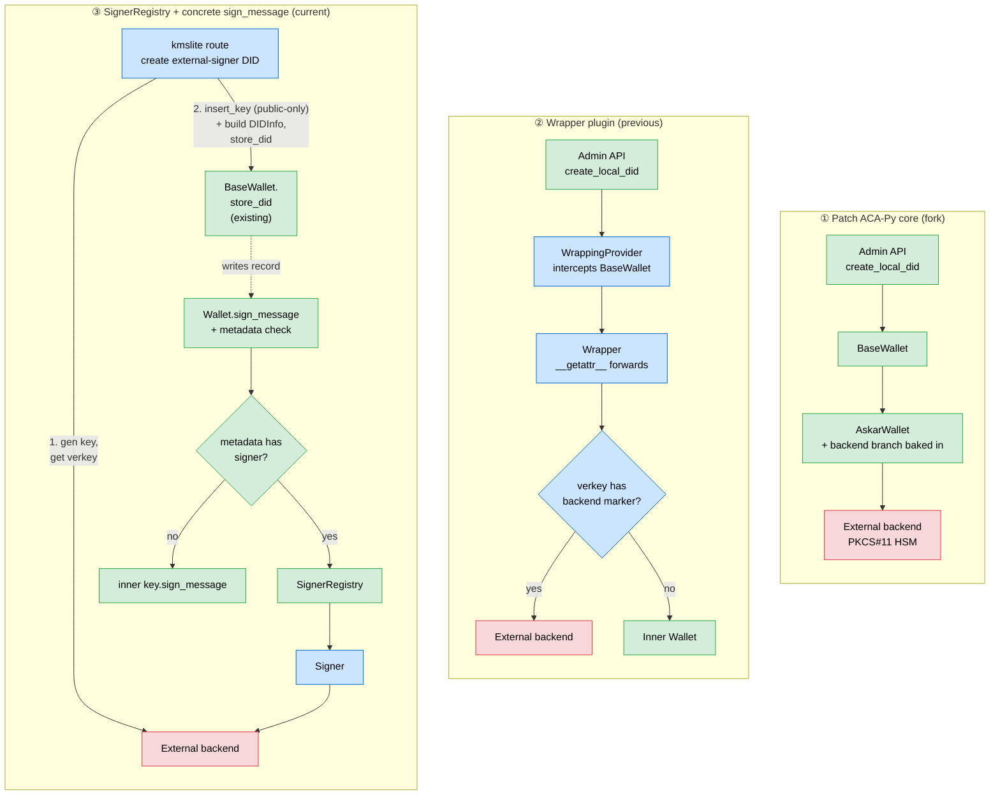

# `kmslite` — External Key-Holder Integration for ACA-Py

> ACA-Py plugin providing external key protection for DIDs — today via a PKCS#11 HSM (Luna as reference) — and X.509 certificate enrollment, via a pluggable external-signer registry.

## Purpose

**Goal:** `kmslite` delivers two capabilities through a single plugin:

1. **External signer integration for key material** — DIDs whose private key is held outside the wallet (in a PKCS#11 HSM) are generated and signed via the configured backend. Private keys never leave their holder; the agent holds only the public key and an opaque reference (the HSM object label).
2. **X.509 certificate enrollment for DIDs** — export a DID's public key, sign a CSR, and bind the resulting certificate to the DID. The certificate becomes part of the DID record (in `metadata`) and is consumed by formats that require it (notably mDOC / mDL under ISO 18013-5).

Design properties:

- **Extension seam preserved** — the plugin uses a `SignerRegistry` + `PROTOCOL_IMPLEMENTATIONS` map so a second signer (e.g. cloud KMS, Vault) can be added later as one new signer class. Only PKCS#11 is shipped today.
- **Narrow privilege** — the plugin only sees sign requests for keys it explicitly registered. Software keys, DID records, and sign dispatch remain owned by the wallet.
- **Opt-in for operators** — with no KMS configuration the plugin only exposes X.509 routes. External-signer routing activates only when a backend is configured and a request creates a DID under that provider.

> **Requires ACA-Py core support.** This design depends on the `SignerRegistry` registry and making `BaseWallet.sign_message` a concrete (non-abstract) method. See [Core Changes Required](#core-changes-required) below.

---

## Architecture



> **Ownership:** 🟢 ACA-Py core · 🔵 `kmslite` plugin · 🔴 external backend.

> **How dispatch works.** At DID creation, the plugin (1) imports a **public-only Askar key** for the verkey via `session.handle.insert_key(verkey, Key.from_public_bytes(...))` and (2) builds a `DIDInfo` whose `metadata` carries `signer` and `key_ref`, then persists it via the wallet's existing `store_did(did_info)`. No private key material is written to Askar. On every `sign_message(message, from_verkey)` call, the base wallet resolves the DID via `get_local_did_for_verkey(from_verkey)`, reads `metadata.signer`, and if set, dispatches through `SignerRegistry`; otherwise it falls through to the subclass's in-wallet signing path. The wallet owns dispatch — no wrapper, no monkey-patching. See [Key Creation](#key-creation) and [Signing Flow](#signing-flow) below for the step-by-step call sequences.

---

| Route | Purpose |
|---|---|
| `POST /kmslite/did/create` | Create a DID whose key is held by the configured external signer (body: `{ method, key_type, options: { did, key_ref } }`). Distinct from the stock `POST /wallet/did/create` (software-key DIDs), avoiding any handler-override ambiguity. |
| `GET /kmslite/did/{did}/public-key` | Export public key as PEM (X.509 enrollment helper) |
| `POST /kmslite/did/{did}/csr` | Generate signed CSR |
| `POST /kmslite/did/{did}/certificate` | Attach X.509 cert (body: `{ cert_pem }`; stored as DID metadata). Route rejects the cert with `400` if its `SubjectPublicKeyInfo` doesn't match `did_info.verkey`. |
| `GET /kmslite/did/{did}/certificate` | Retrieve stored cert |

All routes are registered on the ACA-Py admin API and inherit its authentication (`--admin-api-key` / `--admin-insecure-mode`) and transport controls. The plugin adds no separate auth layer; standard admin-API operational guidance applies (do not expose the admin endpoint to untrusted networks).

---

## Backend Selection

A single `kmslite` plugin supports one external-signer backend per deployment. Two operator-facing knobs preserve the extension seam for future backends:

| Setting | What it identifies | Where it lives |
|---|---|---|
| `provider` | The backend — *who holds the key* (today: `hsm`) | Plugin config; persisted into DID metadata as `signer` |
| `protocol` | The transport — *how the plugin talks to that backend* (today: `pkcs11`) | Plugin config only; not persisted |

At startup, the plugin maps `protocol` → signer class via a small dispatch table, instantiates it with the protocol-specific config block, and registers it under `provider` in `SignerRegistry`:

```python
# kmslite/v1_0/__init__.py
PROTOCOL_IMPLEMENTATIONS = {
    "pkcs11": PKCS11Signer,
    # future protocols slot in here as one line each.
}
```

Full `setup(context)` wiring — including the guard for missing config — lives in [Plugin setup](#2-plugin-setup).

- DID records carry `signer="..."` so the wallet's `sign_message` knows which signer to dispatch to.
- The `protocol` choice is invisible to core and to `sign_message` consumers. If a second transport is ever added for the same backend, only plugin config changes — no stored DIDs change.
- Vendor bindings (today: `python-pkcs11`) are optional extras and imported lazily inside each signer class.

---

## DID Records & Metadata

DIDs in ACA-Py are stored as `DIDInfo` records. The plugin keeps **all** of its per-DID state inside `metadata`; no custom records are introduced.



Lifecycle: **create** (external signer generates key; plugin imports a public-only Askar key entry via `session.handle.insert_key(...)`, then builds the `DIDInfo` with `signer` / `key_ref` metadata and persists it via the wallet's existing `store_did`) → **bind cert** (optional, write metadata) → **sign** (wallet inspects metadata, dispatches via registry or signs locally).

**Sample `DIDInfo` (external-signer-backed `did:web`, after cert binding):**

```json
{
  "did": "did:web:issuer.example.com",
  "verkey": "8HH5gYEeNc3z7PYXmd54d4x6qAfCNrqQqEB3nS7Zfu7K",
  "method": "web",
  "key_type": "p256",
  "metadata": {
    "signer": "hsm",
    "key_ref": "issuer-p256-2026-01",
    "x509_certificate_pem": "-----BEGIN CERTIFICATE-----\nMIICxjCCAm2gAwIBAgIUO...\n-----END CERTIFICATE-----\n"
  }
}
```

**Sample software-key `DIDInfo` (no external signer, no cert):**

```json
{
  "did": "did:key:z6MkhaXgBZDvotDkL5257faiztiGiC2QtKLGpbnnEGta2doK",
  "verkey": "8HH5gYEeNc3z7PYXmd54d4x6qAfCNrqQqEB3nS7Zfu7K",
  "method": "key",
  "key_type": "ed25519",
  "metadata": {}
}
```

---

## Key Creation

External-signer DID creation uses a plugin-owned route — the key must be generated in the backend first, then registered with the wallet:

```
POST /kmslite/did/create
body: {
  "method": "web",
  "key_type": "p256",
  "options": {
    "did": "did:web:issuer.example.com",
    "key_ref": "issuer-p256-2026-01"     // backend-specific identifier
  }
}
```

**`options.did` rules by method** — a DID is either operator-supplied (web-style) or derived from the verkey (key-style). The route validates this per method:

| DID method | `options.did` | Behaviour |
|---|---|---|
| `web`, `webvh` | **required** | Operator-supplied; the route accepts and persists as-is. Publishing `did.json` at the corresponding HTTPS location is the operator's responsibility. |
| `key` | **forbidden** | Derived from the verkey using the appropriate multicodec (P-256 → `p256-pub` / `0x1200`). Route ignores/rejects any operator-supplied value. |
| `peer:2`, `peer:4` | **forbidden** | Derived per the `did:peer` method specification. |
| `sov`, `indy` | not used by this route | Ledger-bound DIDs are out of scope for the reference release. |

Software-key DIDs continue to use the stock `POST /wallet/did/create` endpoint — no plugin involvement. The two paths are distinct, so there is no handler override or registration-order concern.

```mermaid
sequenceDiagram
    participant Client
    participant Route as POST /kmslite/did/create<br/>(kmslite route)
    participant Signer as Signer (kmslite)
    participant Backend as External backend
    participant Wallet as BaseWallet

    Client->>Route: { method, key_type, options: { did, key_ref } }
    Route->>Signer: generate_keypair(key_ref, key_type)
    Signer->>Backend: C_GenerateKeyPair<br/>(non-extractable, sensitive)
    Backend-->>Signer: handle / key id
    Signer->>Backend: get_public_key(handle / id)
    Backend-->>Signer: public key bytes
    Signer-->>Route: verkey (base58 of SEC1-compressed)
    Route->>Wallet: insert_key(verkey,<br/>Key.from_public_bytes(alg, pub_bytes))
    Note right of Wallet: public-only Askar entry;<br/>fetch_key(verkey) will now succeed<br/>but has no secret material
    Route->>Route: build DIDInfo(verkey,<br/>metadata={signer, key_ref})
    Route->>Wallet: store_did(did_info)
    Wallet->>Wallet: persist DIDInfo
    Wallet-->>Route: DIDInfo
    Route-->>Client: DIDInfo
```

---

## Signing Flow



**Signature format.** `sign_message` returns the same raw shape Askar's `key.sign_message` returns today, regardless of the underlying signer:

| Key type | Signature encoding | Length |
|---|---|---|
| `p256` | Raw `r ‖ s` (concatenated, big-endian, fixed-width) | 64 bytes |
| `ed25519` | Raw `R ‖ S` | 64 bytes |
| `bls12381g2` | Raw compressed signature | 96 bytes |

This matches JOSE / COSE expectations (`ES256`, `EdDSA`) directly, so JWT / SD-JWT / mDOC paths need no conversion. Consumers that require **DER-encoded `SEQUENCE(r, s)`** (X.509 CSRs and certificates) are responsible for the conversion — done inside `kmslite`'s X.509 helpers via a `cryptography`-library private-key adapter, see [X.509 helpers](#4-x509-helpers).

---

## X.509 Certificate Enrollment

```mermaid
sequenceDiagram
    participant Admin as Operator
    participant Plugin as kmslite (routes)
    participant Wallet as BaseWallet
    participant CA as IACA

    Admin->>Plugin: GET /kmslite/did/{did}/public-key
    Plugin->>Wallet: get_local_did(did)
    Wallet-->>Plugin: verkey
    Plugin-->>Admin: public key (PEM)

    Admin->>Plugin: POST /kmslite/did/{did}/csr { cn, country }
    Plugin->>Plugin: build CSR via cryptography.x509;<br/>pass WalletBackedPrivateKey(verkey) as signer
    Plugin->>Wallet: adapter.sign(tbs_bytes, ECDSA(SHA256()))<br/>→ sign_message(tbs_bytes, verkey)
    Note right of Wallet: dispatches via SignerRegistry<br/>if metadata has signer<br/>(see Signing Flow)
    Wallet-->>Plugin: raw r‖s (64 B)
    Plugin->>Plugin: adapter re-encodes as ASN.1 DER SEQUENCE(r, s)
    Plugin-->>Admin: signed CSR (PEM)

    Admin->>CA: submit CSR
    CA-->>Admin: X.509 certificate

    Admin->>Plugin: POST /kmslite/did/{did}/certificate { cert_pem }
    Plugin->>Plugin: parse cert, extract SubjectPublicKeyInfo;<br/>compare to did_info.verkey (via verkey_to_public_key)
    alt SPKI matches verkey
        Plugin->>Wallet: store cert as DID metadata (x509_certificate_pem)
        Wallet-->>Plugin: OK
        Plugin-->>Admin: 200 OK
    else mismatch
        Plugin-->>Admin: 400 Bad Request<br/>(cert public key ≠ DID verkey)
    end
```

The adapter pattern serves both flows that need DER-encoded ECDSA:

- **CSR signing** — `cryptography.x509.CertificateSigningRequestBuilder.sign(private_key, hashes.SHA256())`
- **IACA certificate issuance** (when the plugin is the CA) — `cryptography.x509.CertificateBuilder.sign(private_key, hashes.SHA256())`

Both accept any object implementing the `EllipticCurvePrivateKey` interface. `WalletBackedPrivateKey` (in `x509.py`) implements that interface by forwarding `sign(...)` to `wallet.sign_message(...)` and re-encoding the raw `r‖s` result as DER.

---

## Configuration

kmslite reads its configuration from ACA-Py's **plugin-config** channel
(populated by either `--plugin-config <file>` or `-o key=value`), with
environment variables as a fallback. It does **not** require a section in
the main ACA-Py argument file.

**Recommended (inline `-o` on the command line — no separate file needed):**

```sh
export HSM_PIN="s3cret"

aca-py start \
  -o kmslite.provider=hsm \
  -o kmslite.protocol=pkcs11 \
  -o kmslite.pkcs11.library_path=<LUNA_LIB_PATH> \
  -o kmslite.pkcs11.token_name=dev-token \
  -o kmslite.pkcs11.pin_env=HSM_PIN \
  -o kmslite.pkcs11.pool_size=4 \
  ...
```

`-o` is `--plugin-config-value`. VALUE is YAML-parsed (so `4` is int, `true`
is bool). Deep keys use dots. Repeatable. `-o` merges on top of anything
loaded via `--plugin-config`.

**File form (`--plugin-config <file>`):**

```yaml
plugin_config:
  kmslite:
    provider: hsm
    protocol: pkcs11
    pkcs11:
      library_path: <LUNA_LIB_PATH>
      token_name: dev-token
      pin_env: HSM_PIN
      pool_size: 4
      slot: 0
```

**Environment-variable fallback:**

```sh
export KMSLITE_PROVIDER="hsm"
export KMSLITE_PROTOCOL="pkcs11"
export KMSLITE_PKCS11_LIBRARY_PATH="<LUNA_LIB_PATH>"
export KMSLITE_PKCS11_TOKEN_NAME="dev-token"
export KMSLITE_PKCS11_PIN="s3cret"            # PIN itself (direct)
export KMSLITE_PKCS11_POOL_SIZE="4"           # optional, default 4
export KMSLITE_PKCS11_SLOT="0"                # optional
```

| Setting | Plugin-config key (`-o` or file) | Env var | Purpose |
|---|---|---|---|
| provider | `kmslite.provider` | `KMSLITE_PROVIDER` | Backend identity; persisted into DID metadata as `signer`. Pick a stable name once — renaming requires DID-metadata migration. |
| protocol | `kmslite.protocol` | `KMSLITE_PROTOCOL` | Signer implementation to load. Today only `pkcs11`. Deploy-time switch; not persisted. |
| PKCS#11 library | `kmslite.pkcs11.library_path` | `KMSLITE_PKCS11_LIBRARY_PATH` | Filesystem path to the token's `.so` / `.dylib` / `.dll`. |
| PKCS#11 token | `kmslite.pkcs11.token_name` | `KMSLITE_PKCS11_TOKEN_NAME` | `CKA_LABEL` of the token to open. |
| PIN (direct) | — | `KMSLITE_PKCS11_PIN` | The actual PIN. Used as fallback if `pin_env` isn't set. |
| PIN (indirect) | `kmslite.pkcs11.pin_env` | — | Names an env var that holds the PIN (keeps the PIN out of the config file). |
| Pool size | `kmslite.pkcs11.pool_size` | `KMSLITE_PKCS11_POOL_SIZE` | Authenticated PKCS#11 sessions kept in the pool; bounds HSM concurrency. Default `4`. |
| Slot ID | `kmslite.pkcs11.slot` | `KMSLITE_PKCS11_SLOT` | Optional; ignored today (token is looked up by label). |

**Precedence**: plugin-config value wins if set, otherwise the env var, otherwise a default (or an error for required fields).

With none of the three sources configuring the plugin, only the X.509 routes are exposed; no external signer is registered, and no DIDs gain external-signer dispatch.

The operator is responsible for publishing the `did:web` DID document (`did.json`) at the expected HTTPS location with the exported public key as the verification method. This is out of scope for the plugin.

---

## Key Lifecycle

`kmslite` does not ship key-management endpoints today. The plugin creates keys in the HSM at DID creation time and thereafter only reads / signs. Lifecycle operations are the operator's responsibility, using HSM-native tooling (Luna's `cmu` / `lunacm` / vendor console). Current semantics:

| Operation | Behaviour |
|---|---|
| **Create** | `POST /kmslite/did/create` generates a fresh HSM key under the supplied `key_ref` (PKCS#11 `CKA_LABEL`) and stores the DID. If a key with that label already exists on the token, `C_GenerateKeyPair` fails with `CKR_ATTRIBUTE_VALUE_INVALID` (or vendor-equivalent duplicate-label error); the plugin surfaces this as `WalletError` and no DID is written. |
| **Delete DID** | Removing a DID via the standard ACA-Py wallet routes deletes the DID record only. The corresponding HSM key **is not touched** \u2014 it becomes orphaned in the token. Operators clean up via HSM admin tools when appropriate. |
| **Rotate `key_ref`** | Not supported. `key_ref` is baked into DID metadata at creation and treated as immutable. A rotation implies a new key, a new verkey, and therefore a new DID; the old DID may remain resolvable until unpublished. |
| **List external-signer DIDs** | Use the standard ACA-Py DID list endpoints and filter by `metadata.signer == "<provider>"` client-side. |

Rationale: HSMs are already the source of truth for key lifecycle in the operator's compliance regime (audit, backup, dual-control deletion, etc.). Adding rotation / deletion routes to the plugin would duplicate that control surface and require careful coordination with HSM policy \u2014 out of scope for the reference release.

---

## Algorithm Support

Standard ACA-Py key types — same values for software-backed and external-signer-backed DIDs:

| Algorithm | KeyType constant (string value) | JOSE `alg` | Status |
|---|---|---|---|
| P-256 | `P256` (`"p256"`) | `ES256` | Implemented |
| Ed25519 | `ED25519` (`"ed25519"`) | `EdDSA` | Future |
| P-384 | *not in ACA-Py core today* | `ES384` | Future — requires adding a `P384` `KeyType` constant to `acapy_agent/wallet/key_type.py` first |

ACA-Py core today defines `ED25519`, `X25519`, `P256`, and the BLS12-381 variants. Adding `P-384` (or any other curve) is a one-line addition to `key_type.py` plus algorithm wiring in the relevant crypto path.

Per-backend algorithm availability is determined by the configured signer. Each signer maps the standard `KeyType` to its backend's native algorithm identifier. Example (PKCS#11 signer):

| `KeyType` | PKCS#11 mechanism |
|---|---|
| `p256` | `CKM_ECDSA` |
| `ed25519` | `CKM_EDDSA` |
| `p384` *(once added to core)* | `CKM_ECDSA` |

---

## Core Changes Required

The plugin depends on two small additions to ACA-Py core:

1. **`SignerRegistry`** — a root-context-bound registry of named signer implementations.
2. **`BaseWallet.sign_message` becomes concrete** — currently `@abstractmethod`; this change provides a base implementation that dispatches to a registered `Signer` when the DID's metadata says so. Subclasses keep their existing `sign_message` and call `super()` first; if it returns a signature, they return it, otherwise they fall through to their normal in-wallet path.

No new wallet method is introduced. DID creation for external-signer keys uses two existing primitives back-to-back: `session.handle.insert_key(verkey, Key.from_public_bytes(...), metadata=...)` imports a public-only Askar key entry, and `BaseWallet.store_did(did_info)` persists the DID record with the `signer` / `key_ref` marker in `metadata`.

### Registry (new module)

```python
# acapy_agent/wallet/signer_registry.py
class Signer(Protocol):
    async def sign(self, key_ref, message, key_type) -> bytes: ...

class SignerRegistry:
    def register(self, name: str, signer: Signer) -> None: ...
    def get(self, name: str) -> Signer | None: ...
```

### `BaseWallet.sign_message`

`sign_message` becomes a concrete method on `BaseWallet` (no longer `@abstractmethod`) and its return type widens to `Optional[bytes]`: a real signature if the verkey's DID is marked as signer-held, or `None` to mean "not handled here, subclass falls through." Explicit `None` avoids relying on a magic zero-length-signature sentinel and keeps the contract clear for any future algorithm.

```python
# acapy_agent/wallet/base.py
class BaseWallet(ABC):
    async def sign_message(self, message, from_verkey) -> Optional[bytes]:
        # 1. Look up the DID record by verkey (uses each wallet's existing primitive).
        did_info = await self.get_local_did_for_verkey(from_verkey)

        # 2. No external-signer marker → tell the subclass to handle it.
        signer_name = did_info.metadata.get("signer")
        if not signer_name:
            return None

        # 3. Resolve the registered signer and dispatch.
        registry = self._context.inject(SignerRegistry)
        signer = registry.get(signer_name)
        if signer is None:
            raise WalletError(f"No signer registered as {signer_name!r}")

        key_ref = did_info.metadata["key_ref"]
        return await signer.sign(key_ref, message, did_info.key_type)
```

This method is concrete and shared across all wallets. It reads through the existing `get_local_did_for_verkey` primitive (which resolves DIDs from the `CATEGORY_DID` record store via the `verkey` tag — no key-store lookup); the marker lives in `DIDInfo.metadata` (see [DID Records & Metadata](#did-records--metadata)).

> **Verified against `acapy-agent` 1.6.0.** Both `AskarWallet.store_did` and `KanonWallet.store_did` write only to the DID record store; they neither read nor write the Askar key store. Askar's own `Key.from_public_bytes(KeyAlg.P256, sec1_compressed_bytes)` accepts a public-key-only import, and `session.handle.insert_key(verkey, public_key, metadata=...)` persists it as a public-only entry. Combining the two — `insert_key` with the imported public key, then `store_did` with the marker metadata — uses only existing wallet primitives; no new API is introduced.

**`get_signing_key` and `fetch_key` behaviour.** Because the plugin inserts a public-only Askar key, `session.handle.fetch_key(verkey)` returns a `KeyEntry` for external verkeys and `BaseWallet.get_signing_key(verkey)` returns a `KeyInfo` — both work uniformly for software- and HSM-backed DIDs. What is not present is the private key material; any attempt to invoke `key.sign_message(...)` directly on the fetched entry (bypassing `BaseWallet.sign_message`) raises `AskarError: Undefined secret key`. Callers should always sign through `wallet.sign_message`, which dispatches via `SignerRegistry` for external DIDs.

### Per-wallet implementation

The two supported `wallet-type`s — `askar-anoncreds` (`AskarWallet`) and `kanon-anoncreds` (`KanonWallet`) — are independent `BaseWallet` subclasses, both backed by the aries-askar Rust keystore. Each prepends two lines to its existing `sign_message`:

```python
# acapy_agent/wallet/askar.py and kanon_wallet.py
async def sign_message(self, message, from_verkey) -> bytes:
    sig = await super().sign_message(message, from_verkey)
    if sig is not None:
        return sig
    # ... existing implementation unchanged ...
```

That is the entire per-wallet change.

**Footprint:** new wallets cost two lines (the `super()` call) to gain external-signer support; new backends cost zero core changes — they ship as plugins that register a signer with `SignerRegistry` at startup. See [Appendix B](#appendix-b--design-comparison-alternatives) for comparison with alternative designs.

---

## Plugin Contents

The plugin ships PKCS#11 as the reference and only backend today — it covers any HSM with a PKCS#11 library (Luna is the primary target; BouncyHSM is used for development). Additional protocols slot into the same `PROTOCOL_IMPLEMENTATIONS` map when needed.

```
kmslite/v1_0/
├── __init__.py              # setup(): build signer, register in SignerRegistry, install routes
├── signers/
│   ├── base.py              # implements core's Signer Protocol
│   └── pkcs11.py            # PKCS11Signer — the implemented backend
├── routes.py                # /kmslite/did/* and /kmslite/did/{did}/{public-key,csr,certificate}
└── x509.py                  # CSR build + cert validation helpers
```

### 1. PKCS#11 signer

One class implementing the core `Signer` Protocol, backed by `python-pkcs11`. P-256 is the only supported algorithm today (matches AMVAA mDL requirements). Keys are created with `CKA_SENSITIVE=true` and `CKA_EXTRACTABLE=false` so they can never leave the token; `key_ref` is the PKCS#11 object label.

| Method | Responsibility |
|---|---|
| `from_config(cfg)` | Read `library_path`, `slot`, `token_name`, `pin_env`, `pool_size`; open the library and build the session pool (see [Session pool](#session-pool) below). |
| `generate_keypair(key_ref, key_type) → str` | Acquire a session from the pool, `session.generate_keypair(KeyType.EC, mechanism=EC_KEY_PAIR_GEN, …)` with non-extractable / sensitive template; read the resulting public EC point, convert to **SEC1-compressed form (33 bytes for P-256, `0x02`/`0x03` prefix)**, and return `bytes_to_b58(...)`. Format matches `aries_askar.Key.get_public_bytes()` → `bytes_to_b58` so the returned string drops straight into `DIDInfo.verkey`. |
| `get_public_key(key_ref) → str` | Acquire a session from the pool, re-read the public key for an existing label, and return it as base58(SEC1-compressed) — same encoding as `generate_keypair`. Used by the `/public-key` route (which wraps it in a PEM `SubjectPublicKeyInfo`). |
| `sign(key_ref, message, key_type) → bytes` | Acquire a session from the pool, SHA-256 the message, sign with `Mechanism.ECDSA`, return **raw `r‖s`** (64 bytes for P-256). Format matches `AskarWallet.sign_message` so `sign_message` output is uniform across software- and HSM-backed keys. Consumers that need DER (X.509) convert at the boundary — see [X.509 helpers](#4-x509-helpers). |

> **Verkey contract for all signers.** `Signer.generate_keypair` and `Signer.get_public_key` return a **base58-encoded** public key in the exact form that `aries_askar.Key.get_public_bytes()` produces for the same `KeyAlg` (verified in `aries-askar` 0.5.0: `ED25519` = 32 raw bytes; `P256` = 33-byte SEC1-compressed point; `BLS12_381_G2` = 96 bytes). This is what `DIDInfo.verkey`, `get_local_did_for_verkey(verkey)`, and the multicodec derivation used by `did:key` all expect — no wrapping, no PEM, no uncompressed points.

```python
# kmslite/v1_0/signers/pkcs11.py (sketch)
class PKCS11Signer:
    """Implements the core Signer Protocol against a PKCS#11 token."""

    @classmethod
    def from_config(cls, cfg) -> "PKCS11Signer":
        return cls(
            lib_path=cfg["library_path"],
            token_label=cfg["token_name"],
            pin=os.environ[cfg["pin_env"]],
            slot_index=cfg.get("slot"),
            pool_size=cfg.get("pool_size", 4),
        )

    def __init__(self, lib_path, token_label, pin, slot_index, pool_size):
        self._lib = pkcs11.lib(lib_path)
        self._token = self._lib.get_token(token_label=token_label)
        # Bounded pool of authenticated sessions. Each element is a live
        # (session, per-session lock) pair; the queue itself bounds concurrency.
        self._pool: asyncio.Queue = asyncio.Queue(maxsize=pool_size)
        for _ in range(pool_size):
            session = self._token.open(user_pin=pin, rw=True)
            self._pool.put_nowait(session)

    @asynccontextmanager
    async def _session(self):
        session = await self._pool.get()
        try:
            yield session
        finally:
            self._pool.put_nowait(session)

    async def generate_keypair(self, key_ref: str, key_type) -> str:
        if key_type != KeyType.P256:
            raise WalletError(f"PKCS11Signer: unsupported key_type {key_type}")
        async with self._session() as session:
            pub_point = await asyncio.to_thread(self._create_p256_key, session, key_ref)
        # Compress the SEC1 uncompressed point (0x04 || X || Y, 65 B) to (0x02|0x03 || X, 33 B).
        compressed = _sec1_compress(pub_point)
        return bytes_to_b58(compressed)

    async def sign(self, key_ref: str, message: bytes, key_type) -> bytes:
        # PKCS#11 ECDSA signs a digest, not the raw message.
        digest = hashlib.sha256(message).digest()
        async with self._session() as session:
            return await asyncio.to_thread(self._sign_digest, session, digest, key_ref)
```

#### Session pool

`python-pkcs11` sessions are not safe for concurrent operations — two overlapping `sign` calls on the same session interleave inside the C library and corrupt state. `PKCS11Signer` therefore keeps a bounded pool of authenticated sessions (`pool_size`, default `4`); every `generate_keypair` / `sign` / `get_public_key` call acquires one session for the duration of the operation via `_session()` and returns it. Concurrency is capped at `pool_size`; further callers wait on the `asyncio.Queue`. Blocking `python-pkcs11` calls run inside `asyncio.to_thread(...)` so the agent's event loop stays responsive.

Sizing guidance: set `pool_size` at or below the HSM's per-partition session limit (Luna typically permits 32–64 concurrent sessions per partition; `4` covers OID4VCI issuance workloads with headroom). Login happens once per session at pool build time — there is no per-request PIN traffic. Rotating the HSM PIN therefore requires updating `$HSM_PIN` and restarting the agent; there is no live re-login path today.

#### Auditing

Every `generate_keypair` and `sign` call emits one structured record to `logging.getLogger("kmslite.audit")` at `INFO`. This gives ops the *why* to pair with the HSM's own *what* — the HSM log records "key `X` signed at time `T`", the audit log records "for `provider=hsm`, `key_ref=X`, `key_type=p256`, over digest `<sha256>`". Operators route the logger wherever their SIEM lives; the plugin doesn't ship a pipeline.

Record schema (passed as the `extra` dict on the log call, so structured-log formatters pick it up as fields):

| Field | Value | Notes |
|---|---|---|
| `event` | `"generate_keypair"` \| `"sign"` | |
| `provider` | e.g. `"hsm"` | Matches `DIDInfo.metadata.signer`. |
| `key_ref` | PKCS#11 `CKA_LABEL` | |
| `key_type` | e.g. `"p256"` | |
| `message_digest` | SHA-256 hex of the payload | `sign` only. Enables correlation without logging payloads. |

**Not logged** (deliberate): the raw message (may contain holder PII in mDOC / CSR payloads); the signature bytes; the PIN or any credentials.

Adding Ed25519 / P-384 is a per-mechanism table addition in this file plus a one-line `KeyType` add in core (see [Algorithm Support](#algorithm-support)). Adding a second protocol is one new file in `signers/` plus an entry in `PROTOCOL_IMPLEMENTATIONS` — no other code in the plugin or in core needs to change.

### 2. Plugin setup

A single `setup(context)` picks the signer class for the configured `protocol`, instantiates it, registers it in `SignerRegistry` under the configured `provider` name, and installs the HTTP routes:

```python
# kmslite/v1_0/__init__.py
PROTOCOL_IMPLEMENTATIONS = {
    "pkcs11": PKCS11Signer,
}

async def setup(context: InjectionContext) -> None:
    cfg = context.settings.get("kmslite")
    if cfg:
        SignerCls = PROTOCOL_IMPLEMENTATIONS[cfg["protocol"]]
        signer = SignerCls.from_config(cfg[cfg["protocol"]])
        context.inject(SignerRegistry).register(cfg["provider"], signer)
    # Routes are always installed (X.509 endpoints work for any DID).
    await routes.register(context)
```

If `kmslite` is absent from config, no signer is registered — the plugin still loads, only the X.509 routes are exposed, and no DIDs gain external-signer dispatch.

### 3. Routes

The route handlers are thin — they parse input, call the configured signer for key generation, import the public key into Askar as a public-only entry via `session.handle.insert_key(...)`, build a `DIDInfo` with the signer marker in metadata, and hand it to the wallet's existing `store_did(...)`. The plugin uses only existing wallet-layer and Askar primitives — no new wallet API is introduced.

```python
# kmslite/v1_0/routes.py (sketch)
async def create_kms_did(request):
    body = await request.json()
    cfg = context.settings["kmslite"]
    signer = context.inject(SignerRegistry).get(cfg["provider"])

    method = body["method"]
    key_ref = body["options"]["key_ref"]
    verkey: str = await signer.generate_keypair(key_ref, body["key_type"])  # base58(compressed)

    # Per-method DID resolution: web-style is operator-supplied; key-style is derived.
    did = _resolve_did(method, body["options"].get("did"), verkey, body["key_type"])

    metadata = {"signer": cfg["provider"], "key_ref": key_ref}
    did_info = DIDInfo(
        did=did,
        verkey=verkey,
        method=method,
        key_type=body["key_type"],
        metadata=metadata,
    )
    async with context.profile.session() as session:
        # 1. Import the public key into Askar as a public-only entry.
        #    Askar's Key.from_public_bytes accepts SEC1-compressed for P-256.
        pub_bytes = b58_to_bytes(verkey)
        askar_key = Key.from_public_bytes(_keyalg_for(body["key_type"]), pub_bytes)
        await session.handle.insert_key(verkey, askar_key, metadata=json.dumps(metadata))
        # 2. Persist the DID record via the standard wallet API.
        wallet = session.inject(BaseWallet)
        did_info = await wallet.store_did(did_info)
    return web.json_response(did_info.serialize())
```

The `insert_key` step imports a public-only Askar key entry so that `fetch_key(verkey)` and `wallet.get_signing_key(verkey)` succeed uniformly for software- and HSM-backed DIDs (see [`BaseWallet.sign_message`](#basewalletsign_message)). The entry has no private material; every signing operation still routes through `SignerRegistry`.

> **Mirrored metadata is intentional.** The `{signer, key_ref}` marker is written to both the DID record (via `store_did`) and the key entry (via `insert_key(metadata=...)`). Dispatch reads only the DID record — but the mirror keeps parity with `AskarWallet.create_local_did`'s existing dual-write pattern, so `wallet.get_signing_key(verkey).metadata` returns the marker for external DIDs just as it does for software keys. The mirror is a write-once snapshot (subsequent DID-metadata updates via `replace_local_did_metadata` don't propagate to the key entry) — safe because `signer` and `key_ref` are immutable by design.

`_resolve_did(...)` enforces the [rules table above](#key-creation): requires `options.did` for `web`/`webvh`, derives it from the verkey for `key`/`peer:*`, and raises `WalletError` for unsupported methods or malformed inputs.

The X.509 routes follow the same pattern — they read the DID via standard wallet APIs, use `WalletBackedPrivateKey` (see below) to drive `cryptography.x509` builders (which internally call `wallet.sign_message` and dispatch through the registry automatically), and store the returned cert as DID metadata.

### 4. X.509 helpers

Pure helpers, no persistent state — build/validate CSRs and certificates using the `cryptography` library. The centrepiece is a small adapter that lets any `sign_message`-capable wallet slot into `cryptography.x509` builders:

```python
# kmslite/v1_0/x509.py (sketch)
import asyncio
from cryptography.hazmat.primitives.asymmetric import ec, utils
from cryptography.hazmat.primitives.asymmetric.ec import EllipticCurvePrivateKey

class WalletBackedPrivateKey(EllipticCurvePrivateKey):
    """Adapter that satisfies EllipticCurvePrivateKey by delegating to wallet.sign_message.

    Lets cryptography.x509.{CertificateBuilder, CertificateSigningRequestBuilder}.sign(...)
    drive an HSM- or software-backed key uniformly.

    Note: cryptography's builder .sign() is synchronous. To bridge back to the async
    wallet, the route runs CSR / cert construction inside asyncio.to_thread(...) and
    the adapter dispatches via run_coroutine_threadsafe on the captured loop.
    """
    def __init__(self, wallet, verkey, loop, curve=ec.SECP256R1()):
        self._wallet, self._verkey, self._loop, self._curve = wallet, verkey, loop, curve

    def sign(self, data: bytes, signature_algorithm) -> bytes:
        # sign_message returns raw r‖s; cryptography.x509 requires DER SEQUENCE(r, s).
        fut = asyncio.run_coroutine_threadsafe(
            self._wallet.sign_message(data, self._verkey), self._loop,
        )
        raw = fut.result()
        n = len(raw) // 2
        r = int.from_bytes(raw[:n], "big")
        s = int.from_bytes(raw[n:], "big")
        return utils.encode_dss_signature(r, s)

    @property
    def curve(self):
        return self._curve
    # public_key() returns EllipticCurvePublicKey from the stored verkey.
    # private_numbers() / private_bytes() / exchange() raise NotImplementedError —
    # cryptography.x509 builders don't call them; only sign() / curve / public_key() are needed.
```

Route-side glue (sketch):

```python
# csr route handler
loop = asyncio.get_running_loop()
adapter = WalletBackedPrivateKey(wallet, did_info.verkey, loop)
csr_pem = await asyncio.to_thread(_build_csr_sync, adapter, subject)  # runs cryptography builder off-loop
```

Helper functions in the same module: `build_csr(wallet, did_info, subject) → PEM`, `validate_cert_chain(cert_pem, iaca_root_pem) → None|raise`, `verkey_to_public_key(verkey, key_type) → EllipticCurvePublicKey`, `assert_cert_matches_verkey(cert_pem, verkey, key_type) → None|raise` (compares the cert's `SubjectPublicKeyInfo` against the DID's verkey; called from the cert-binding route). All consume only the wallet API and standard `cryptography` primitives — no direct signer or backend coupling.

---

## Failure Modes

<!-- TODO: HSM unreachable, session pool exhausted, error propagation & retry policy -->

---

## Testing

<!-- TODO: BouncyHSM for unit / integration tests, mocking strategy, fixtures -->

---

## Health & Metrics

<!-- TODO: HSM connectivity check, /status/live extension, prom metrics -->

---

## Design Decisions

| # | Decision | Rationale |
|---|---|---|
| 1 | External signer integration via core registry | Dispatch lives on `BaseWallet.sign_message` (made concrete); subclasses call `super()` first, preserving their existing method name and signature. DID creation reuses `session.handle.insert_key(...)` (public-only key entry) + the existing `store_did(did_info)` — no new wallet API. The plugin sees only its own keys; the wallet retains ownership of DID records and software-key dispatch. |
| 2 | Non-extractable backend keys | PKCS#11 keys are created with `CKA_SENSITIVE=true` and `CKA_EXTRACTABLE=false` so they can never leave the token. No API path exposes private-key material. |
| 3 | Provider / protocol split | `provider` (backend identity) is persisted into DID metadata as `signer`; `protocol` (transport) is deploy-time-only. Lets operators switch transports against the same backend without touching stored DIDs. |
| 4 | `key_ref` as opaque identifier | Plugin-defined string (today: PKCS#11 `CKA_LABEL`); wallet and core treat it as opaque. |
| 5 | X.509 cert as DID metadata | No custom records; CSR signs via the wallet's normal `sign_message` path, which dispatches via the registry. |
| 6 | P-256 first | AMVAA mDL requires ES256 / secp256r1; broader algorithm support depends on backend capabilities (see Algorithm Support). |

---

## Appendices

### Appendix A — OID4VCI Integration

How each credential format reaches the wallet (and therefore the HSM, when configured):

| Format | Path | HSM-ready? |
|---|---|---|
| JWT VC (`jwt_vc_json`) | `jwt_sign()` → `wallet.sign_message()` | Yes |
| SD-JWT VC (`sd_jwt_vc`) | `jwt_sign()` → `wallet.sign_message()` | Yes |
| mDOC / mDL (`mso_mdoc`) | `MdocSigningKeyRecord.private_key_pem` → Rust FFI | **No** |

JWT- and SD-JWT-based formats already flow through `BaseWallet.sign_message()`, so the base-class dispatch picks them up automatically. mDOC is the outlier and is addressed below.

#### mDOC Gap

**Why mDOC is the outlier:** the current mDOC library exposes a **one-step** signing API that takes the raw private key as input. To use it, the plugin has to hold the key in cleartext, which defeats HSM protection. The fix is to switch to the **two-step** `PreparedMdoc` API (already on `isomdl-uniffi` main, owned by Indicio), which splits *building the signature payload* from *applying the signature* — letting the wallet sign in between.



---

### Appendix B — Design comparison: alternatives

Three ways external-signer integration *could* be wired into ACA-Py. This plugin uses approach ③ (`SignerRegistry` + concrete `sign_message`); the others are recorded for design rationale. Lanes share the same vertical layers (API → wallet → backend); colour denotes ownership: 🟢 ACA-Py core, 🔵 plugin code, 🔴 external backend. The diagram makes one thing immediately visible — **how much of the call path the plugin sits on**:

- **① Patch core** — no plugin; HSM/KMS logic baked into core wallets. Zero plugin surface, maximum core maintenance burden.
- **② Wrapper plugin (previous design)** — plugin intercepts the *entire* `BaseWallet` surface for every call, installed via monkey-patching `ProfileSession._setup`. Broad privilege, brittle coupling to private internals.
- **③ `SignerRegistry` + concrete `sign_message` (current design)** — plugin code only at the endpoints (key generation + signer callback); core owns DID records and sign dispatch. DID creation reuses existing `insert_key` + `store_did`; no new wallet method. Narrow privilege.



|  | ③ Current design | ② Wrapper (previous) | ① Patch core |
|---|---|---|---|
| **Where the work lives** | ACA-Py core (small, opt-in) + plugin (signer + setup) | Plugin only (monkey-patches `_setup`) | ACA-Py core (both wallets + routes) |
| **Pros** | <ul><li>Narrow privilege — plugin only sees its own keys</li><li>Dispatch in one place (`BaseWallet`)</li><li>Same pattern extends to additional protocols when needed</li></ul> | <ul><li>Ships entirely in the plugin</li><li>No core PR</li></ul> | <ul><li>One repo, one release</li><li>No plugin machinery</li></ul> |
| **Cons** | <ul><li>Requires an upstream PR</li><li>Every wallet wanting external signers must add a `super()` call</li></ul> | <ul><li>Plugin sees every wallet call (broad privilege)</li><li>Brittle coupling to private internals</li><li>Multiple wrapper plugins collide</li></ul> | <ul><li>Maintainers won't accept backend code in core</li><li>Locks you to ACA-Py's release cadence</li><li>Every new backend re-opens core</li></ul> |
