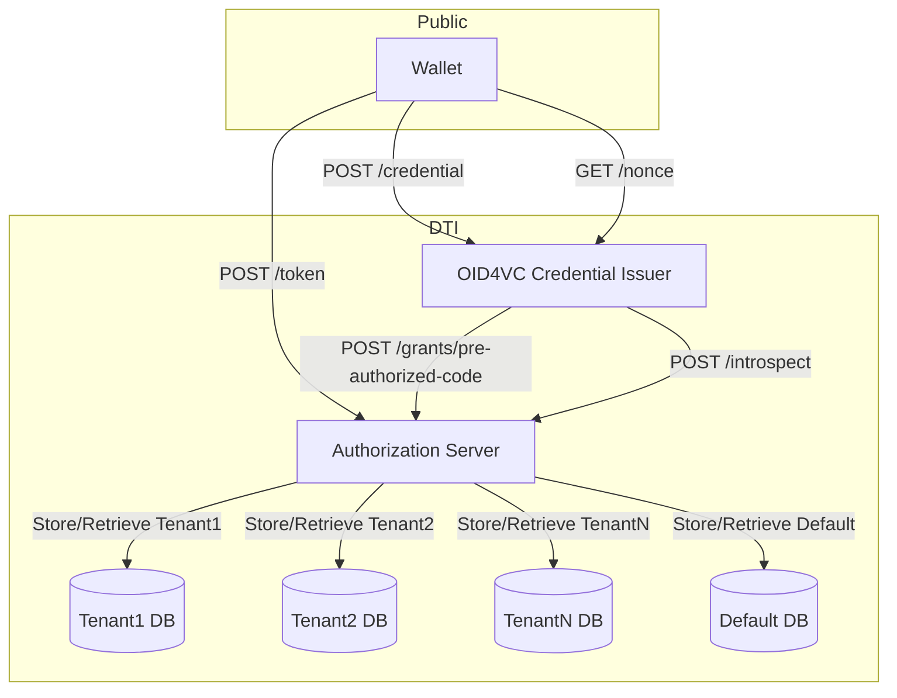
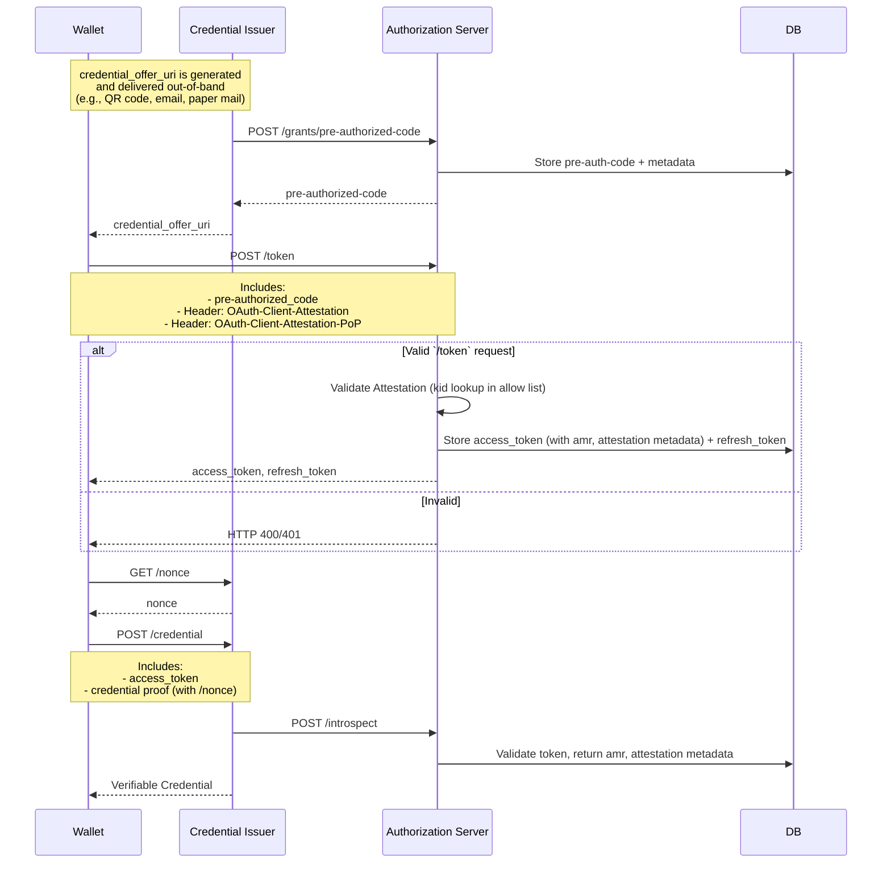
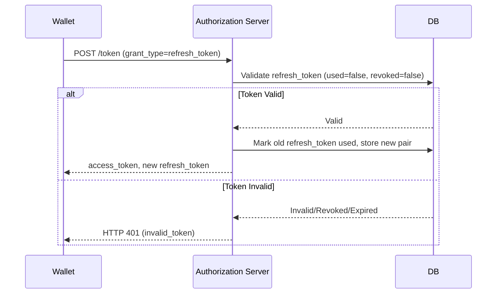
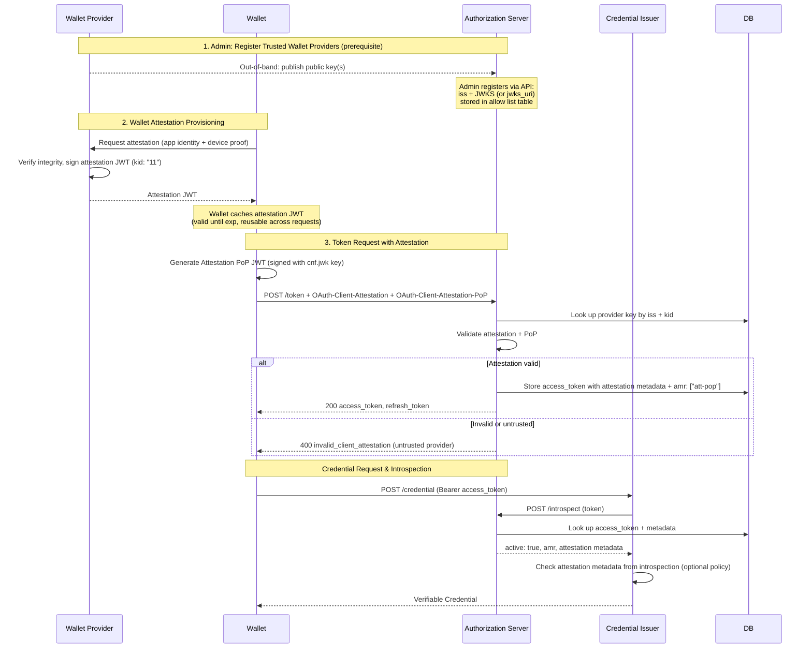
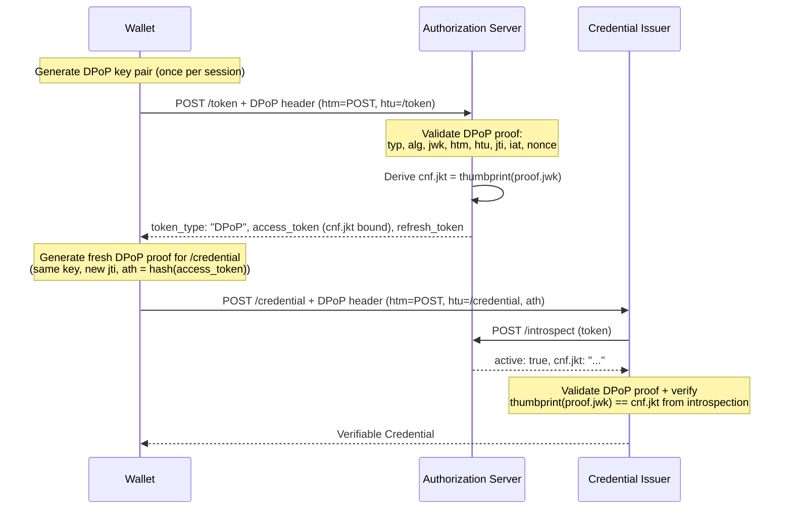
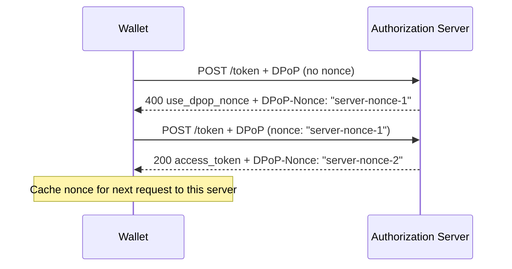
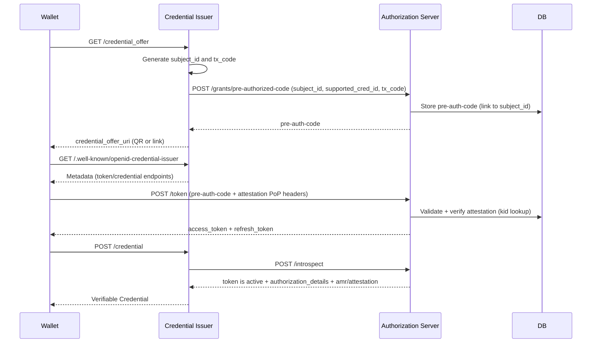
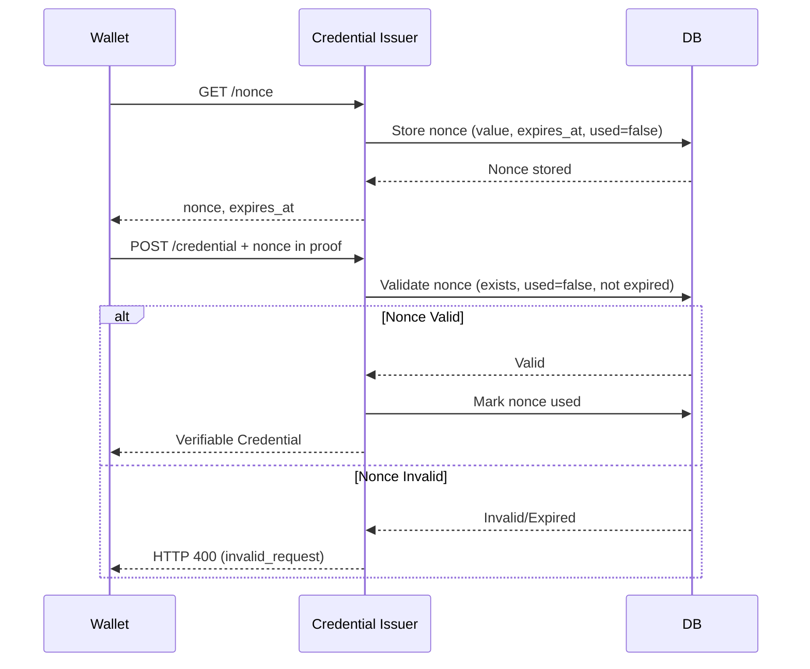
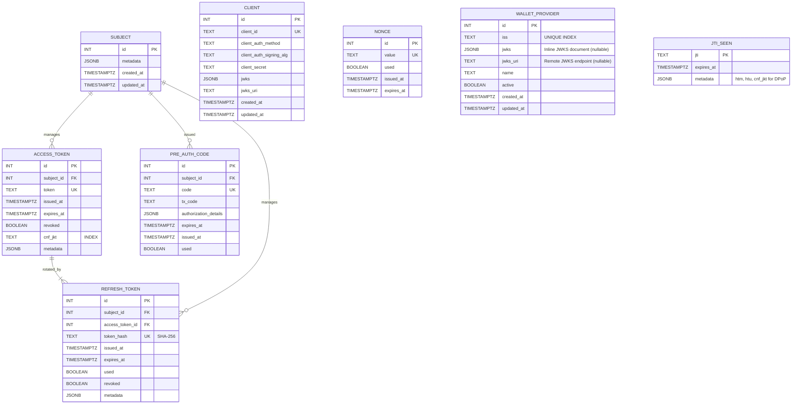

# OpenID for Verifiable Credential Issuance with Authorization Server

> Reference implementation of OID4VCI-compliant issuance with a decoupled Authorization Server

## 📌 Overview

This project delivers a **modular, production-ready Authorization Server** purpose-built for **OpenID for Verifiable Credential Issuance (OID4VCI)** workflows.

While the existing OID4VCI Credential Issuer handled prototype-grade authorization internally, this work cleanly separates that responsibility by introducing a **dedicated Authorization Server (AS)**. The Issuer is now focused solely on credential generation, while **all access control, grant issuance, token validation, and attestation PoP verification** are delegated to the AS.

This system supports **secure, standards-aligned issuance of Verifiable Credentials (VCs)** and is designed for integration with modern digital wallets. It includes:

- 🔐 **Pre-Authorized Code Flow** – Enables issuance without user login
- 🛡️ **DPoP-bound Access Tokens** – Proof-of-possession enforcement ([RFC 9449](https://www.rfc-editor.org/rfc/rfc9449.html))
- 📄 **Authorization Details** – Credential-specific authorization rules ([RFC 9396](https://www.rfc-editor.org/rfc/rfc9396.html))
- 🧾 **Attestation PoP** – Wallet Provider signs an attestation JWT (`kid`-based); Wallet Instance signs an attestation PoP JWT; the Authorization Server verifies both against a managed allow list of trusted providers
- 🔁 **Refresh Token Rotation** – Mitigates token reuse and supports long-lived sessions
- 🧠 **Token Introspection** – Fine-grained validation with embedded credential metadata
- 🌐 **Metadata Discovery** – Standards-based wallet interoperability via `.well-known` endpoints

### 🔧 Core Components

- **Authorization Server** (FastAPI + Authlib)
- **Credential Issuer** with delegated authorization and introspection integration
- **PostgreSQL** for persistence of grants, tokens, and credential metadata
- **Support for DPoP, Authorization Details, Attestation PoP, Refresh Token rotation**

This architecture separates concerns, improves security, enhances extensibility, and provides a scalable foundation for OID4VCI credential issuance in production environments.

---

## 🔗 Multi-Tenancy

The system supports multi-tenancy for data isolation in OID4VCI workflows. The Credential Issuer and Authorization Server use a **database-per-tenant** model, where each tenant has a dedicated PostgreSQL database with the same schema (e.g., `SUBJECT`, `ACCESS_TOKEN`).

**Key Features**:

- **Database-Per-Tenant Model**:

  - Each tenant (identified by `tenant-id`) maps to a separate database (e.g., `tenant1_db`).
  - In single-tenant deployments, non-prefixed endpoints like `/token` and `/credential` implicitly use the default tenant (`default_db`).
  - All tenant databases use the same schema version via Alembic migrations.
  - Enforcement: Tokens must only be used in the context of their issuing tenant. Cross-tenant use returns HTTP 401 (`invalid_token`).

- **Tenant Configuration**:

  - Mappings stored in a configuration file or central store:

    | Tenant ID | Database URL                  |
    | --------- | ----------------------------- |
    | tenant1   | `postgresql://.../tenant1_db` |
    | tenant2   | `postgresql://.../tenant2_db` |
    | default   | `postgresql://.../default_db` |

- **Endpoint Structures**:

  - Multi-Tenant: Prefix with `/tenants/{tenant-id}/` (e.g., `/tenants/tenant1/token`).
  - Single-Tenant: Use non-prefixed endpoints (e.g., `/token`).

- **Token Scoping**:

  - Tokens include a realm claim (e.g., `"realm": "tenant1"`).
  - Validation ensures realm matches request context during introspection.

- **Security and Isolation**:

  - Physical separation prevents cross-tenant leakage.
  - Tenant-specific DB credentials and CORS restrictions.
  - Errors: `400 invalid_tenant` – Tenant not found.

- **Provisioning and Maintenance**:
  - Automate with scripts (e.g., `CREATE DATABASE tenant1_db;` then schema migration).
  - Migrations: Use Alembic to apply changes across databases.
  - Monitoring: Per-tenant performance monitoring with tools like `pg_stat_activity`.

---

## 🛠️ Key Features & Requirements Mapping

| #   | Feature                      | Component            | Description                                              |
| --- | ---------------------------- | -------------------- | -------------------------------------------------------- |
| 1   | Credential update & re-issue | Credential Issuer    | Revoked credential can be reissued; old version deleted. |
| 2   | Credential cleanup           | Cron + DB            | Periodic cleanup of expired credentials.                 |
| 3   | Refresh Token issued         | Auth Server          | Every access token comes with a refresh token.           |
| 4   | Refresh Token rotation       | Auth Server          | One-time-use refresh tokens; replaced with each request. |
| 5   | Decoupled authorization      | Auth Server + Config | Tokens validated externally or by config-swappable AS.   |
| 6   | Attestation verification     | Authorization Server | Verify attestation JWT + attestation PoP JWT at `/token`  |
| 7   | `/nonce` endpoint            | Credential Issuer    | Required by OID4VCI; prevents nonce reuse.               |

---

## 🧩 Component Architecture



**Note**:

- `credential_offer_uri` is generated and delivered out-of-band (QR code, email, paper mail).\_
- For multi-tenant deployments, endpoints can be prefixed with `/tenants/{tenant-id}/` to route to tenant-specific databases. See the [Multi-Tenancy](#-multi-tenancy) section for details on the database-per-tenant model and token scoping with the `realm` claim.

---

## 🔄 Credential Issuance Flow

Covers:

- Pre-authorized code grant registration
- DPoP
- Attestation PoP
- Token introspection and credential delivery
- Wallet requests a nonce from `/nonce` for credential proof replay protection
- Optional refresh token for subsequent credential requests

### 🧬 Initial Credential Issuance



---

### 🧬 Refresh Token Flow



---

### 🛡️ Enforcement Points

| Component            | Validates                                                                                                                                  |
| -------------------- | ------------------------------------------------------------------------------------------------------------------------------------------ |
| Authorization Server | Pre-auth code; **Attestation JWT** (verified via `kid` + allow list); **Attestation PoP JWT** (wallet instance proof); refresh token rotation (validated for `used=false`) |
| Credential Issuer    | Introspection (active token, realm match); Nonce proof                                                         |

---

### 📦 Notes

- Attestation JWT is verified by the Authorization Server at `/token` using `kid` + `iss` lookup against the allow list of trusted Wallet Providers.
- The attestation `cnf.jwk` contains the wallet instance's public key. The `OAuth-Client-Attestation-PoP` JWT proves the wallet holds the corresponding private key.
- The Issuer uses `/introspect` to validate the access token and retrieve embedded claims (e.g., `amr` and `attestation` metadata).
- Wallets **do not** send attestation to `/credential`; it’s only relevant at `/token`.

---

## 🧾 Attestation PoP

**Purpose:** Provide an additional verifiable PoP signal at `/token`, ensuring the client is a legitimate wallet attested by a trusted Wallet Provider.

### Flow

1. **Attestation JWT (signed by Wallet Provider)**

   - Wallet Provider signs the JWT with their private key.
   - Header: `typ` (`oauth-client-attestation+jwt`), `alg`, `kid`.
   - Payload: `iss` (Wallet Provider identifier), `sub` (client_id — see note below), `cnf.jwk`, `iat`, `exp`.
   - The `cnf.jwk` contains the wallet instance's public key, binding the attestation to the wallet instance.
   - Sent via the `OAuth-Client-Attestation` HTTP header.
   - **`sub` claim semantics (OID4VCI §15.4.4):** The `sub` value SHOULD identify the **wallet type** (e.g., `https://wallet.example.org`), NOT a unique per-instance identifier. All wallet instances of the same Wallet Provider share the same `sub` value to prevent cross-Authorization-Server correlation of individual users.

2. **Attestation PoP JWT (signed by Wallet Instance)**

   - Wallet Instance signs a proof-of-possession JWT with the private key corresponding to the `cnf.jwk` in the attestation.
   - Header: `typ` (`oauth-client-attestation-pop+jwt`), `alg`.
   - Payload: `iss` (client_id — MUST match `sub` of the attestation JWT), `aud` (Authorization Server issuer identifier), `jti` (unique identifier for replay detection), `iat`, and optionally `challenge` (server-provided).
   - Proves the wallet holds the attested key.
   - Sent via the `OAuth-Client-Attestation-PoP` HTTP header.

3. **Allow List (Trusted Wallet Providers)**

   - Admin registers trusted providers via API: `iss` + JWKS document (inline `jwks`) or `jwks_uri`.
   - Each provider row stores the full keyset; individual keys are resolved by `kid` at verification time.
   - Provider keys are obtained out-of-band (e.g., published on wallet provider's website).
   - If `jwks_uri` is provided, keys are fetched on-demand with SSRF protection and LRU caching.
   - This is a closed ecosystem — no DID resolution or discoverability needed.

4. **Verification (Authorization Server)**

   - Extract `kid` from header and `iss` from payload.
   - Look up the provider's public key by `iss` + `kid` in the allow list.
   - Verify attestation JWT signature using the provider's public key.
   - Validate claims (`iss`, `sub`, `iat`, `exp`) and time validity (± clock skew).
   - Extract `cnf.jwk` and verify the `OAuth-Client-Attestation-PoP` JWT signature against it (proves wallet instance holds the attested key).

5. **Outcome**
   - If `iss` + `kid` not found → `invalid_client_attestation` (untrusted provider).
   - If signature or claims invalid → `invalid_client_attestation`.
   - On success:
     - Compute `cnf_jkt = thumbprint(cnf.jwk)` (RFC 7638) and store on `ACCESS_TOKEN.cnf_jkt`.
     - Record attestation metadata (iss, kid, sub, cnf_jkt, pop_jti, iat, exp) in `ACCESS_TOKEN.metadata`.
     - Add `"att-pop"` to `amr`.
   - On refresh without new attestation headers, the previous token's attestation metadata and `cnf_jkt` are carried forward to the new access token.

### Example `/token` Request (with Attestation PoP)

```http
POST /token
Content-Type: application/x-www-form-urlencoded
OAuth-Client-Attestation: <attestation JWT signed by Wallet Provider>
OAuth-Client-Attestation-PoP: <attestation PoP JWT signed by Wallet Instance>

grant_type=urn:ietf:params:oauth:grant-type:pre-authorized_code&
pre-authorized_code=abc123
```



---

## 🔐 DPoP (Demonstration of Proof-of-Possession)

### ✅ Overview

DPoP ([RFC 9449](https://www.rfc-editor.org/rfc/rfc9449.html)) binds access tokens to a client's asymmetric key pair, preventing unauthorized use of stolen tokens. Even if an attacker exfiltrates an access token, they cannot use it without the corresponding private key.

### ✅ Support

- **Required at `/token`** (Authorization Server) and **`/credential`** (Credential Issuer).
- Access tokens are issued with `"token_type": "DPoP"` (not `"Bearer"`).
- Access tokens include a `cnf.jkt` claim (JWK Thumbprint per [RFC 7638](https://www.rfc-editor.org/rfc/rfc7638.html)) binding the token to the client's DPoP key.
- Replay protection via `jti` claim on DPoP proof JWTs, tracked in `JTI_SEEN`.
- Server-provided nonce support via `DPoP-Nonce` response header and `use_dpop_nonce` error.

### 🔑 DPoP Key vs. Attestation Key

DPoP and Client Attestation are **independent mechanisms** that serve different purposes:

| Mechanism | Purpose | Key |
|-----------|---------|-----|
| Client Attestation | Proves the client is a legitimate wallet instance | `cnf.jwk` in attestation JWT |
| DPoP | Binds the access token to the client, preventing token theft | DPoP key pair (in `DPoP` header `jwk`) |

The wallet MAY use the **same key** for both (the attestation `cnf.jwk` private key also signs DPoP proofs), or it MAY use separate keys. The Authorization Server does not enforce a relationship between them — they are validated independently.

### 🧬 DPoP Proof JWT Structure

Each DPoP proof is a JWT with:

**Header:**
```json
{
  "typ": "dpop+jwt",
  "alg": "ES256",
  "jwk": { "kty": "EC", "crv": "P-256", "x": "...", "y": "..." }
}
```

**Payload (at `/token`):**
```json
{
  "jti": "unique-id-per-request",
  "htm": "POST",
  "htu": "https://auth.example.com/tenants/{tenant-id}/token",
  "iat": 1721028000,
  "nonce": "server-provided-nonce"
}
```

**Payload (at `/credential` — resource server):**
```json
{
  "jti": "unique-id-per-request",
  "htm": "POST",
  "htu": "https://issuer.example.com/credential",
  "iat": 1721028000,
  "ath": "fUHyO2r2Z3DZ53EsNrWBb0xWXoaNy59IiKCAqksmQEo",
  "nonce": "server-provided-nonce"
}
```

The `ath` claim is the base64url-encoded SHA-256 hash of the access token — required when the DPoP proof accompanies a token at a resource server (RFC 9449 §4.2).

### 🧬 Token Binding Flow with DPoP



### 🔄 Nonce Flow (Optional Server-Enforced)

The Authorization Server MAY require a nonce in DPoP proofs to limit proof reuse windows:



### 🛠️ Authorization Server Validation (RFC 9449 §4.3)

When the `DPoP` header is present at `/token`, the Authorization Server MUST:

1. Verify exactly one `DPoP` header is present.
2. Decode and validate the JWT structure.
3. Verify `typ` header is `dpop+jwt`.
4. Verify `alg` is a supported asymmetric algorithm (e.g., `ES256`) and not `none`.
5. Verify the JWT signature using the public key in the `jwk` header.
6. Verify `jwk` does not contain a private key.
7. Verify `htm` matches the HTTP method (`POST`).
8. Verify `htu` matches the request URI (scheme + authority + path, no query/fragment).
9. If nonce is required, verify the `nonce` claim matches the server-provided value.
10. Verify `iat` is within an acceptable time window.
11. Verify `jti` has not been seen before (replay prevention via `JTI_SEEN` table).
12. Derive `cnf.jkt` = base64url(SHA-256(canonicalized JWK)) and store on the access token.

### 🛠️ Credential Issuer Validation

When the wallet presents a DPoP-bound token at `/credential`, the Credential Issuer MUST:

1. Validate the DPoP proof (steps 1–11 above, with `htu` = credential endpoint URL).
2. Verify the `ath` claim equals base64url(SHA-256(access_token)).
3. Call `/introspect` to get the token's `cnf.jkt`.
4. Verify `thumbprint(proof.jwk) == cnf.jkt` (key binding check).

### 📦 Storage & Metadata

- `ACCESS_TOKEN.cnf_jkt`: Stores the DPoP key thumbprint bound to the token.
- `JTI_SEEN.metadata`: For DPoP proofs, stores `{"htm": "POST", "htu": "...", "cnf_jkt": "..."}`.
- DPoP nonces: Stored server-side with time-based rotation (configurable window).

### 🔒 Error Responses

| Error | HTTP Status | When |
|-------|-------------|------|
| `invalid_dpop_proof` | 400 | Malformed proof, bad signature, wrong `htm`/`htu`, expired `iat`, unknown `alg` |
| `use_dpop_nonce` | 400 | Server requires nonce but none provided, or nonce is stale (includes `DPoP-Nonce` header) |
| `invalid_token` | 401 | DPoP key thumbprint doesn't match `cnf.jkt` on the token (at resource server) |

### 📝 `.well-known` Discovery

The Authorization Server metadata SHOULD include:
```json
{
  "dpop_signing_alg_values_supported": ["ES256"]
}
```

---

## 🔄 RFC 7591/7592: Dynamic Client Registration

The Credential Issuer, acting on behalf of a trusted program owner, performs client registration internally when generating a credential offer. It ensures:

- Only authorized credential offers are issued
- Wallets are provisioned with appropriate scopes and authorization context
- Client metadata is linked to the credential issuance transaction (e.g., `tx_code`, `supported_cred_id`)

The Credential Issuer registers the subject of the credential using `subject_id` (UUID or another privacy-preserving identifier).



---

## 🔐 Nonce Replay Prevention Controls

To prevent replay attacks in the credential issuance process, the `/nonce` endpoint provides a unique, time-bound nonce for use in the `/credential` request proof. Controls:

- Nonces are stored in the `NONCE` table with a unique `value`, `used` flag, and `expires_at`.
- The Issuer validates that the nonce exists, is unused, and unexpired; then marks it `used`.
- Invalid/expired → HTTP 400 `invalid_request`.
- Periodic cleanup of expired nonces.
- Rate limit `/nonce` (e.g., 10 req/min/IP).

**Nonce Flow**



---

## 📘 API Endpoints

### Authorization Server

| Endpoint                            | Method | Auth                                      | Description                          |
| ----------------------------------- | ------ | ----------------------------------------- | ------------------------------------ |
| `/token`                            | POST   | Optional attestation PoP (via headers)    | Token exchange (pre-auth or refresh) |
| `/introspect`                       | POST   | private_key_jwt \| client_secret_basic | Token validation + attestation       |
| `/grants/pre-authorized-code`       | POST   | private_key_jwt \| client_secret_basic | Issue a pre-authorized code grant.   |
| `/.well-known/openid-configuration` | GET    | None                                      | Auth Server metadata discovery       |

### Credential Issuer

| Endpoint                                | Method | Auth          | Description                      |
| --------------------------------------- | ------ | ------------- | -------------------------------- |
| `/credential_offer`                     | GET    | None          | Offer URI with pre-auth code     |
| `/credential`                           | POST   | Bearer | Request VC                       |
| `/nonce`                                | GET    | None          | Nonce for credential proof       |
| `/.well-known/openid-credential-issuer` | GET    | None          | OID4VC Issuer metadata discovery |

---

### 🔐 `POST /token`

Exchanges a pre-authorized code or refresh token for an access token (and new refresh token for rotation). If policy requires attestation PoP, the request must include `OAuth-Client-Attestation` and `OAuth-Client-Attestation-PoP` headers.

**Request**

```http
POST /token
Content-Type: application/x-www-form-urlencoded
OAuth-Client-Attestation: <attestation JWT signed by Wallet Provider>
OAuth-Client-Attestation-PoP: <attestation PoP JWT signed by Wallet Instance>

grant_type=urn:ietf:params:oauth:grant-type:pre-authorized_code&
pre-authorized_code=abc123&
tx_code=1234
```

**Response**

```json
{
  "access_token": "eyJhbGciOi...",
  "refresh_token": "xyz456",
  "token_type": "Bearer",
  "expires_at": "iso-8601-datetime",
  "scope": "openid vc_authn vc_business_card",
  "authorization_details": [
    {
      "type": "openid_credential",
      "format": "vc+sd-jwt",
      "types": ["VerifiableCredential", "OntarioBusinessCard"]
    }
  ],
  "amr": ["att-pop"]
}
```

**Errors**

- HTTP 400 `invalid_request`: Invalid pre-authorized code, malformed attestation PoP.
- HTTP 401 `invalid_token`: Invalid or revoked refresh token.
- HTTP 401 `invalid_attestation`: Attestation PoP required by policy but missing or failed verification.

---

### 📤 `POST /introspect`

Used by the Credential Issuer to verify tokens before releasing credentials. Includes attestation outcome metadata when present.

**Request**

```http
POST /introspect
Authorization: Basic base64(client_id:client_secret)
Content-Type: application/x-www-form-urlencoded

token=eyJhbGciOiJSUzI1NiIsInR5cCI6IkpXVCJ9...
token_type_hint=access_token
```

**Response**

```json
{
  "active": true,
  "scope": "openid vc_authn vc_business_card",
  "subject_id": "c26fe7f5-6bd8-41c5-b0af-c2f555ec89f7",
  "token_type": "Bearer",
  "exp": 1721031600,
  "iat": 1721028000,
  "sub": "did:example:abcd1234",
  "authorization_details": [
    {
      "type": "openid_credential",
      "format": "vc+sd-jwt",
      "types": ["VerifiableCredential", "OntarioBusinessCard"]
    }
  ],
  "cnf": { "jkt": "QmFzZTY0ZW5jb2RlZFRodW1icHJpbnQ=" },
  "iss": "https://auth.example.com",
  "realm": "tenant1",
  "amr": ["att-pop"],
  "attestation": {
    "present": true,
    "verified": true,
    "iss": "https://wallet-provider.example.com",
    "kid": "11",
    "sub": "https://wallet.example.org",
    "cnf_jkt": "QmFzZTY0ZW5jb2RlZFRodW1icHJpbnQ=",
    "pop_jti": "unique-pop-jti-value",
    "iat": 1721028000,
    "exp": 1721031600
  }
}
```

**Errors**

- HTTP 401 `invalid_client`: Invalid client credentials.
- HTTP 400 `invalid_request`: Invalid token or token type hint.

---

### 📤 `POST /credential`

Request a credential using an access token. (No attestation here; enforced at `/token`).

**Request**

```http
POST /credential
Authorization: Bearer eyJhbGciOi...
Content-Type: application/json

{
  "format": "vc+sd-jwt",
  "type": "OntarioBusinessCard",
  "proof": { "proof_type": "jwt", "jwt": "eyJ0eXAiOiJKV1Q..." }
}
```

**Response**

```json
{
  "format": "vc+sd-jwt",
  "credential": "eyJhbGciOiJFZERTQSJ9...sig"
}
```

**Errors**

- HTTP 400 `invalid_request`: Invalid access token or nonce proof.

---

### 🪪 `GET /credential_offer`

Returns the credential offer URI with embedded pre-authorized code.

**Request**

```http
GET /credential_offer
```

**Response**

```json
{
  "credential_offer_uri": "openid-credential-offer://?credential_offer=..."
}
```

Decoded `credential_offer`:

```json
{
  "credential_offer": {
    "credential_issuer": "https://issuer.example.com",
    "grants": {
      "urn:ietf:params:oauth:grant-type:pre-authorized_code": {
        "pre-authorized_code": "abc123"
      }
    },
    "authorization_details": [
      {
        "type": "openid_credential",
        "format": "vc+sd-jwt",
        "types": ["VerifiableCredential", "OntarioBusinessCard"]
      }
    ]
  }
}
```

---

### 🔄 `GET /nonce`

Provides a unique, time-bound nonce for the `/credential` proof to prevent replay attacks. See [Nonce Replay Prevention Controls](#-nonce-replay-prevention-controls).

**Request**

```http
GET /nonce
```

**Response**

```json
{
  "nonce": "123456789abcdef",
  "expires_at": "iso-8601-datetime"
}
```

**Errors**

- HTTP 429 `too_many_requests` if rate limit is exceeded.

---

### 🔄 `GET /.well-known/openid-credential-issuer`

**Request**

```http
GET /.well-known/openid-credential-issuer
```

**Response**

```json
{
  "credential_issuer": "https://issuer.example.com",
  "authorization_server": "https://auth.example.com",
  "token_endpoint": "https://auth.example.com/token",
  "credential_endpoint": "https://issuer.example.com/credential",
  "nonce_endpoint": "https://issuer.example.com/nonce",
  "nonce_lifetime": 300,
  "credentials_supported": {
    "OntarioBusinessCard": {
      "format": "vc+sd-jwt",
      "proof_types_supported": ["jwt"],
      "cryptographic_binding_methods_supported": ["did"],
      "cryptographic_suites_supported": ["ES256"]
    }
  }
}
```

### 🔄 `GET /.well-known/openid-configuration`

**Request**

```http
GET /.well-known/openid-configuration
```

**Response**

```json
{
  "issuer": "https://auth.example.com",
  "token_endpoint": "https://auth.example.com/token",
  "token_endpoint_auth_methods_supported": ["private_key_jwt", "client_secret_basic"],
  "grant_types_supported": [
    "urn:ietf:params:oauth:grant-type:pre-authorized_code",
    "refresh_token"
  ],
  "authorization_details_types_supported": ["openid_credential"],
  "jwks_uri": "https://auth.example.com/jwks",
  "introspection_endpoint": "https://auth.example.com/introspect"
}
```

### 🔍 Error Handling

- Standard OAuth2 errors: `invalid_token`, `expired_token`, `invalid_grant`, etc.
- DPoP errors (planned): `invalid_dpop_proof`, `replay_detected`.
- Nonce errors: `invalid_request` for invalid/expired nonces; `too_many_requests` for exceeding rate limits.
- Attestation errors: `invalid_attestation` if attestation headers are missing/invalid, signature verification fails, Attestation-PoP verification fails, or `iss` + `kid` not found in the allow list.

---

## 🗄️ Database Schema Diagram

This project uses PostgreSQL. Conventions:

- Singular table names.
- Timestamps (`created_at`, `updated_at`) using `TIMESTAMPTZ`.
- Foreign Keys with `ON DELETE CASCADE` where appropriate.
- Indexing on key lookup fields.



**Note**: ACCESS_TOKEN.metadata may include amr and attestation outcome.

---

## 🛡️ Enhancements & Security Notes

- **Logging**: Audit issuance, revocation, refresh events, and attestation outcomes.
- **Observability**: Middleware logs request start/end with `request_id`, `method`, `path`, `status_code`, and `duration_ms`; protected routes include `client_id`.
- **Rate Limiting**: Throttle abuse or brute-force attempts.
- **Token Format**: Access tokens are JWTs with claims (`aud`, `exp`, `cnf`, `amr`, etc.).
- **DPoP Key Lifecycle**: Clients manage DPoP key pairs; rotate if compromised.
- **CORS**: Restrict cross-origin requests where applicable.
- **Refresh Token Hashing**: Refresh tokens are stored as SHA-256 hashes; raw values are never persisted.
- **JTI Replay Prevention**: Client assertion, attestation PoP, and DPoP JTIs are tracked in `JTI_SEEN` (PostgreSQL INSERT ON CONFLICT). Entries persist until the JWT's `exp` claim for client assertions, or a fixed window for attestation PoPs and DPoP proofs. DPoP entries store `htm`, `htu`, and `cnf_jkt` in the `metadata` column.
- **SSRF Protection**: `jwks_uri` fetches validate the scheme, resolve DNS hostnames, and reject private/loopback/link-local/reserved IP addresses before making HTTP requests.
- **LRU-bounded Caches**: Tenant context cache, engine pools, and JWKS caches use `OrderedDict`-based LRU eviction to prevent unbounded memory growth.
- **Migration Safety**: Downgrade operations via `POST /admin/tenants/{uid}/migrations` require explicit `confirm: true` in the request body.
- **Proxy Trust**: `PROXY_TRUSTED_HOSTS` controls which reverse proxies are trusted to set `X-Forwarded-For` headers. Default: `127.0.0.1`. Set to the specific LB/proxy IP in production; never use `"*"`.
- **Algorithm Enforcement**: JWT verification restricts accepted algorithms to the client's configured `client_auth_signing_alg` (or `ES256` default), preventing algorithm confusion attacks.

## 📘 Terminology

- **JWT (JSON Web Token)**: A compact, signed token format (RFC 7519).
- **JWK (JSON Web Key)**: JSON representation of a cryptographic key (RFC 7517).
- **JKT (JWK Thumbprint)**: Base64url-encoded hash of a JWK (RFC 7638). Used in DPoP and in attestation `cnf.jwk` binding.
- **JTI (JWT ID)**: Unique ID for a JWT, used for replay prevention.
- **DPoP**: Mechanism to bind access tokens to a client's key (RFC 9449). Independent from attestation.
- **Attestation PoP**: Two-part client attestation mechanism. The `OAuth-Client-Attestation` header carries a JWT signed by a trusted Wallet Provider (identified by `iss` + `kid`), verified against a managed allow list. The `OAuth-Client-Attestation-PoP` header carries a JWT signed by the Wallet Instance, proving possession of the key in `cnf.jwk`.
- **Pre-authorized Code**: One-time-use code issued by the AS to enable issuance without user login.
- **Realm**: Logical identifier mapping a token to a specific tenant.
