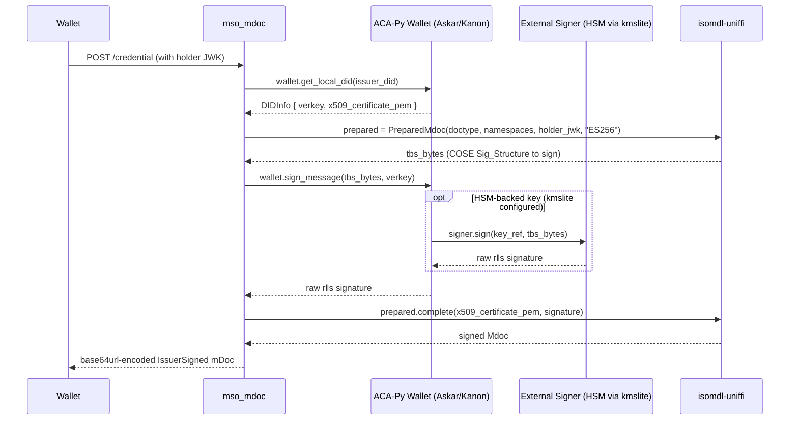

# mso_mdoc

ISO/IEC 18013-5:2021 compliant mobile document (mDoc) credential format for ACA-Py, integrated with the OID4VCI plugin.

## Overview

Issues and verifies mDocs (including mDLs) using the [`isomdl-uniffi`](https://github.com/Indicio-tech/isomdl-uniffi) Rust library via UniFFI bindings. Signing uses the two-step `PreparedMdoc` API so the issuer private key never crosses the FFI boundary — enabling software wallet keys, HSM-backed keys (via `kmslite`), or any `BaseWallet.sign_message`-compatible backend.

## Installation

`isomdl-uniffi` ships as a platform-specific wheel and must be installed separately:

```bash
# Linux x86_64 (used in Docker)
pip install https://github.com/Indicio-tech/isomdl-uniffi/releases/download/v0.1.0-indicio.1/isomdl_uniffi-0.1.0-py3-none-manylinux_2_17_x86_64.manylinux2014_x86_64.whl

# macOS (Intel/Apple Silicon)
pip install https://github.com/Indicio-tech/isomdl-uniffi/releases/download/v0.1.0-indicio.1/isomdl_uniffi-0.1.0-py3-none-macosx_11_0_universal2.whl
```

## Key Management

mso_mdoc follows the same convention as `jwt_vc_json` and `sd_jwt_vc` — the issuer key lives in the wallet and is referenced by DID. Set `issuer_did` on the `SupportedCredential`; at signing time the verkey and X.509 certificate are resolved automatically from `DIDInfo.metadata` (`x509_certificate_pem` stored by `POST /kmslite/did/{did}/certificate`).

```
POST /kmslite/did/create              →  { verkey, did }
POST /kmslite/did/{did}/csr           →  submit to IACA
POST /kmslite/did/{did}/certificate   →  binds cert to DIDInfo.metadata
POST /oid4vci/credential-supported/create/mso-mdoc  →  { ..., "issuer_did": "did:web:..." }
```

### Signing Flow



## Trust Anchors

IACA root certificates used for verification are stored as `TrustAnchorRecord` records:

```
POST   /mso-mdoc/trust-anchors
GET    /mso-mdoc/trust-anchors
GET    /mso-mdoc/trust-anchors/{trust_anchor_id}
DELETE /mso-mdoc/trust-anchors/{trust_anchor_id}
```

## Credential Configuration

Register a supported credential via the OID4VCI routes:

```
POST /oid4vci/credential-supported/create/mso-mdoc
```

Example body:
```json
{
  "format": "mso_mdoc",
  "id": "org.iso.18013.5.1.mDL",
  "doctype": "org.iso.18013.5.1.mDL",
  "cryptographic_binding_methods_supported": ["cose_key"],
  "credential_signing_alg_values_supported": ["ES256"],
  "issuer_did": "did:web:issuer.example.com"
}
```

## Module Structure

```
mso_mdoc/
├── cred_processor.py       # MsoMdocCredProcessor: Issuer + CredVerifier + PresVerifier
├── trust_anchor.py         # TrustAnchorRecord (IACA root certs)
├── trust_anchor_routes.py  # /mso-mdoc/trust-anchors routes
├── routes.py               # /oid4vci/credential-supported mso-mdoc CRUD routes
├── payload.py              # Payload normalisation for isomdl-uniffi
├── mdoc/
│   ├── issuer.py           # isomdl_mdoc_sign, make_wallet_signer
│   ├── cred_verifier.py    # MsoMdocCredVerifier
│   ├── pres_verifier.py    # MsoMdocPresVerifier
│   ├── mdoc_verify.py      # mdoc_verify helper
│   └── utils.py            # PEM chain helpers
└── tests/
```

## Running Tests

```bash
cd oid4vc
uv run pytest mso_mdoc/tests/ -v
```

